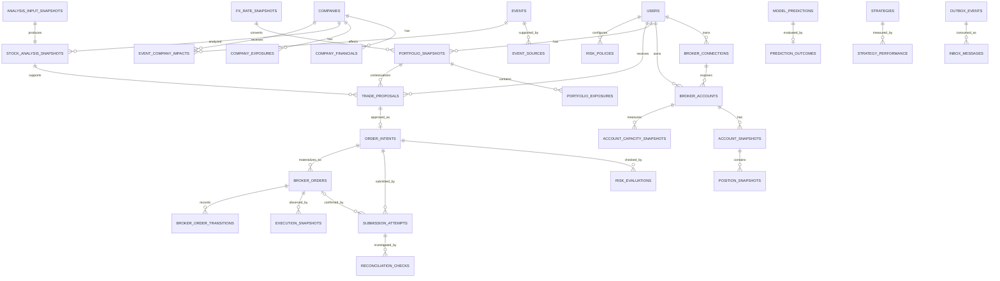
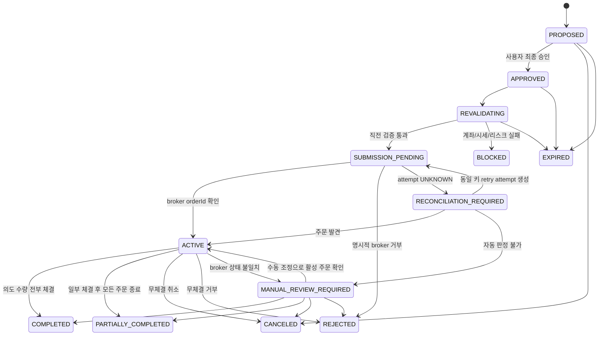
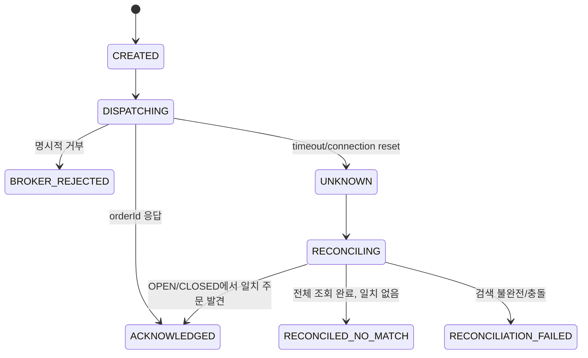
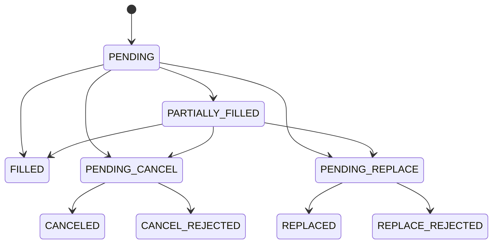

# 미국 주식 포트폴리오·분석·주문 플랫폼 설계

- 작성일: 2026-07-26
- 상태: Draft
- 대상 구조: Spring Boot 모듈러 모놀리스 + 독립 FastAPI 분석 서비스
- 대상 사용자: 다중 사용자 SaaS
- 공식 브로커 문서 기준: 토스증권 Open API `1.2.4`

## 1. 목표

미국 주식의 기업 가치와 시장 상황을 지속적으로 분석하고, 돌발 이벤트가 기존 투자 판단과 포트폴리오에 미치는 영향을 재평가하며, 위험이 통제된 승인형 주문까지 연결한다.

핵심 성공 조건:

- 사용자별 토스증권 계좌·자격증명·주문·감사 데이터를 격리한다.
- 분석 결과는 확률과 범위로 표현하고 입력 데이터 시점과 함께 불변 저장한다.
- Spring Boot가 주문·리스크·감사 원장을 단독 소유한다.
- FastAPI는 분석 결과만 반환하며 주문을 생성하거나 브로커를 호출하지 않는다.
- 사용자 승인 후 실제 주문 직전에 시세, 계좌, 매수·매도 가능 수량, 미체결 주문, 손실 한도를 다시 검증한다.
- 주문 결과가 불명확하면 동일 주문을 무조건 재전송하지 않는다.

## 2. 비목표

- 초고빈도·밀리초 경쟁
- MVP 단계의 무승인 자동매매
- LLM의 주문 결정 또는 브로커 API 직접 호출
- SNS 단독 정보에 따른 주문 후보 생성
- 초기 Kafka, Kubernetes, 마이크로서비스, 별도 그래프 DB
- 토스증권 API만으로 재무·컨센서스·옵션·미국 거시지표 전체를 충당
- 수익 보장 또는 확정적 주가 예측

## 3. 확정 아키텍처

```text
Next.js
   │ HTTPS + SSE
   ▼
Spring Boot modular monolith
   ├─ Identity / Tenant
   ├─ Broker Integration
   ├─ Account / Portfolio
   ├─ Market Data
   ├─ Analysis Orchestration
   ├─ Event Intelligence
   ├─ Trade Proposal
   ├─ Risk
   ├─ Order
   ├─ Performance
   └─ Audit / Outbox
          │
          ├─ PostgreSQL: 거래·리스크·감사 원장과 불변 스냅샷
          ├─ Redis: 세션, 단기 캐시, 분산 락
          ├─ Toss Open API
          └─ FastAPI analysis-service
```

Kafka나 Redpanda는 Outbox 처리량과 재처리 요구가 실제 한계를 넘기 전에는 도입하지 않는다. Spring Modulith도 초기 필수 의존성으로 두지 않고 패키지 경계와 아키텍처 테스트로 모듈성을 지킨다.

---

## 4. 모듈별 책임과 의존 방향

### 4.1 Spring Boot 모듈

| 모듈 | 주요 클래스 | 책임 | 허용 의존 |
|---|---|---|---|
| `identity` | `User`, `SessionService`, `TenantAccessGuard` | 가입, 로그인, 세션, 사용자 데이터 접근 검증 | `audit` |
| `broker` | `BrokerAdapter`, `TossInvestBrokerAdapter`, `TossAuthClient`, `TossAccountClient`, `TossMarketDataClient`, `TossOrderClient`, `TossResponseMapper` | 외부 브로커 DTO와 오류를 내부 계약으로 변환 | `identity`, `audit` |
| `account` | `BrokerAccount`, `AccountSnapshot`, `AccountCapacitySnapshot`, `PositionSnapshot`, `AccountSyncService` | 계좌 연결, 보유종목·주문 가용성 동기화, 데이터 완전성 | `broker`, `identity`, `audit`, `outbox` |
| `portfolio` | `PortfolioSnapshot`, `PortfolioExposure`, `PortfolioRiskSummary`, `PortfolioService` | 사용자 계좌를 포트폴리오 관점으로 집계 | `account`, `marketdata`, `analysis` 읽기 모델 |
| `marketdata` | `Quote`, `OrderBook`, `Candle`, `MarketDataService`, `QuoteFreshnessPolicy` | 현재가·호가·캔들·환율·시장 일정 정규화와 최신성 판정 | `broker`, 외부 데이터 공급자 |
| `analysis` | `AnalysisRequest`, `StockAnalysisSnapshot`, `AnalysisOrchestrator`, `AnalysisServiceClient` | 입력 스냅샷 확정, FastAPI 호출, 결과 검증·저장 | `marketdata`, `outbox`; 이벤트는 불변 `EventImpactInput`만 소비 |
| `event` | `MarketEvent`, `EventSource`, `EventCompanyImpact`, `EventIngestionService` | 공식 소스 수집, 중복 제거, 구조화 요청, 영향 연결, 재분석 요청 발행 | `marketdata`, `outbox` |
| `proposal` | `TradeProposal`, `ProposalPolicy`, `TradeProposalService` | 분석을 사용자별 주문 후보로 변환, 만료 관리 | `analysis`, `portfolio`, `risk` |
| `risk` | `RiskPolicy`, `RiskEvaluation`, `PositionSizer`, `PreTradeRiskService` | 포지션 크기 계산, 포트폴리오 한도, 차단 사유 산출 | `account`, `portfolio`, `marketdata` |
| `order` | `OrderIntent`, `SubmissionAttempt`, `BrokerOrder`, `ExecutionSnapshot`, `OrderApprovalService`, `OrderSubmissionService`, `OrderReconciliationService` | 승인된 주문 의도, 외부 전송 시도, 브로커 주문과 체결 증거를 분리해 관리 | `risk`, `broker`, `account`, `marketdata`, `audit`, `outbox`, `inbox` |
| `performance` | `ModelPrediction`, `PredictionOutcome`, `StrategyPerformance` | 예측 사후 결과와 전략 중단 조건 계산 | `analysis`, `marketdata` |
| `audit` | `AuditLog`, `AuditService` | 보안·분석·리스크·주문 행위의 변경 불가 추적 | 없음 |
| `outbox` | `OutboxEvent`, `OutboxPublisher` | DB 커밋과 비동기 작업 발행의 원자성 보장 | 없음 |
| `inbox` | `InboxMessage`, `InboxConsumer` | consumer별 이벤트 중복 수신 차단과 처리 원자성 | 없음 |

### 4.2 의존 규칙

```text
event ─────► outbox ─────► analysis ─────► proposal
                               │              │
marketdata ────────────────────┘              ▼
account ─────► portfolio ────────► risk
   │                                  │
   └──────────────► order ◄───────────┘
broker ◄────────── account/order/marketdata
audit  ◄────────── 모든 보안·주문 관련 모듈
```

- `analysis`는 `order`와 `broker`를 참조할 수 없다.
- `event`는 `analysis` application service를 직접 호출하지 않는다. `AnalysisRecalculationRequested`를 Outbox에 기록하고 `analysis`가 이벤트 entity가 아닌 `EventImpactInput`을 소비한다.
- `FastAPI`는 Spring Boot DB에 접속할 수 없다.
- `order`는 분석 점수를 직접 해석하지 않고 승인된 `TradeProposal`과 `RiskEvaluation`만 소비한다.
- 사용자 의도는 `OrderIntent`, HTTP 전송은 `SubmissionAttempt`, 토스가 발급한 주문은 `BrokerOrder`가 소유한다. 세 객체의 상태를 하나의 `Order` enum으로 합치지 않는다.
- 모든 사용자 소유 aggregate 조회는 `userId`를 필수 인자로 받는다. 전역 `findById(id)` 형태의 repository API를 금지한다.
- 모듈 간 공유는 공개 application service와 불변 ID/DTO로 제한한다. JPA entity를 모듈 밖으로 노출하지 않는다.

### 4.3 FastAPI 모듈

| 모듈 | 책임 |
|---|---|
| `features` | 시점이 고정된 입력을 분석용 feature로 변환 |
| `fundamental` | 성장성, 현금흐름, 수익성, 부채, 희석, 가이던스 분석 |
| `valuation` | 배수, 동종기업, 과거 범위, 단순 DCF, bear/base/bull 가치 |
| `technical` | 추세, 거래량, 변동성, 지지·저항, 상대강도, 모멘텀 |
| `regime` | 시장 국면 분류와 종목 적합도 |
| `expectations` | 컨센서스, 기대 변동, 뉴스 선반영, 실적 반응 |
| `event_impact` | 이벤트 구조화, 노출도 기반 영향, 반대 시나리오 |
| `forecast` | 1일 상승 확률, 5·20일 기대수익, 예상 최대 손실 |
| `explain` | 근거, 반대 논리, 부족 데이터, 무효화 조건 생성 |
| `contracts` | Pydantic 요청·응답 버전과 검증 |

FastAPI 결과는 주문 행동이 아니라 `analysisResult`와 `suggestedTradePlan`이다. Spring Boot가 정책과 포트폴리오 상태를 결합해 최종 주문 후보를 만든다.

---

## 5. 주요 도메인 모델

### 5.1 사용자와 브로커

```java
record UserId(UUID value) {}
record BrokerAccountId(UUID value) {}

class User {
    UserId id;
    String email;
    UserRole role;
    UserStatus status;
}

class BrokerConnection {
    UUID id;
    UserId userId;
    BrokerType brokerType;          // TOSS_INVEST
    String encryptedClientId;
    String encryptedClientSecret;
    ConnectionStatus status;
    Instant lastValidatedAt;
}

class BrokerAccount {
    BrokerAccountId id;
    UserId userId;
    UUID brokerConnectionId;
    String encryptedAccountNo;
    long externalAccountSeq;
    String accountType;
    AccountStatus status;
}
```

`client_id`, `client_secret`, 계좌번호는 로그·감사 payload·API 응답에서 마스킹한다. SaaS가 개인별 토스 API 자격증명을 보관해 주문을 대행할 수 있는지는 공식 이용약관과 토스증권 확인 전까지 **미확정**이다.

### 5.2 분석

```java
class StockAnalysisSnapshot {
    UUID id;
    String symbol;
    Instant asOf;
    UUID inputSnapshotId;
    String modelVersion;
    AnalysisStatus status;
    Probability oneDayUpProbability;
    BigDecimal fiveDayExpectedReturn;
    BigDecimal twentyDayExpectedReturn;
    BigDecimal expectedMaximumLoss;
    PriceRange fairValue;
    SuggestedTradePlan suggestedTradePlan;
    Confidence confidence;
    List<String> bullCase;
    List<String> counterCase;
    List<String> invalidationConditions;
    List<String> missingData;
}

class AnalysisInputSnapshot {
    UUID id;
    String symbol;
    Instant asOf;
    Instant quoteAsOf;
    String schemaVersion;
    String payloadHash;
    JsonNode immutablePayload;
}
```

분석 결과는 수정하지 않는다. 모델 교체나 이벤트 반영은 새 스냅샷을 생성한다.

### 5.3 이벤트

```java
class MarketEvent {
    UUID id;
    EventType type;
    EventStatus status;
    Set<String> actors;
    Set<String> targets;
    String action;
    Score severity;
    Score novelty;
    Score sourceReliability;
    Instant effectiveAt;
    Instant detectedAt;
}

class EventCompanyImpact {
    UUID eventId;
    UUID companyId;
    ImpactRelation relation;        // DIRECT, INDIRECT, THEME_ONLY, NEGATIVE
    ImpactDirection direction;
    Score magnitude;
    Score alreadyPricedIn;
    Score confidence;
    DurationBucket duration;
}
```

### 5.4 주문 후보와 실거래 원장

```java
class TradeProposal {
    UUID id;
    UserId userId;
    BrokerAccountId accountId;
    UUID analysisSnapshotId;
    UUID portfolioSnapshotId;
    UUID eventId;                   // nullable
    String symbol;
    TradeAction action;
    PriceRange entryRange;
    BigDecimal invalidationPrice;
    PriceRange targetRange;
    BigDecimal proposedQuantity;
    ProposalStatus status;
    Instant expiresAt;
}

class OrderIntent {
    UUID id;
    UserId userId;
    BrokerAccountId accountId;
    UUID tradeProposalId;
    OrderSide side;
    OrderType type;
    String symbol;
    BigDecimal quantity;
    BigDecimal limitPrice;
    Currency tradingCurrency;
    BigDecimal displayedMaximumLoss;
    Instant expiresAt;
    Instant approvedAt;
    OrderIntentStatus status;
    long version;
}

class SubmissionAttempt {
    UUID id;
    UUID orderIntentId;
    int attemptNumber;
    UUID internalIdempotencyKey;       // attempt 영구 unique
    String brokerClientOrderId;        // 동일 intent retry 시 같은 값
    String requestBodyHash;
    UUID confirmedBrokerOrderId;       // nullable; 여러 attempt가 같은 BrokerOrder 확인 가능
    SubmissionAttemptStatus status;    // CREATED, DISPATCHING, ACKNOWLEDGED,
                                       // BROKER_REJECTED, UNKNOWN, RECONCILING,
                                       // RECONCILED_NO_MATCH, RECONCILIATION_FAILED
    UUID retryOfAttemptId;             // nullable
    DispatchEvidence dispatchEvidence; // NOT_STARTED, REQUEST_STARTED, RESPONSE_RECEIVED
    Instant brokerIdempotencyExpiresAt;
    String brokerRequestId;
    Instant startedAt;
    Instant finishedAt;
}

class BrokerOrder {
    UUID id;
    UUID orderIntentId;
    BrokerAccountId brokerAccountId;
    String brokerOrderId;              // 토스 opaque orderId, 필수
    String brokerClientOrderId;
    UUID replacesBrokerOrderId;        // 정정으로 새 주문이 생기면 연결
    BrokerOrderStatus status;
    OrderSide side;
    OrderType type;
    String symbol;
    BigDecimal quantity;
    BigDecimal limitPrice;
    Currency tradingCurrency;
    Instant brokerOrderedAt;
    long version;
}
```

규칙:

- `OrderIntent`는 사용자가 승인한 경제적 의도다. 승인 후 종목, 방향, 수량, 가격, 통화를 바꾸지 않는다.
- 각 외부 HTTP 호출은 별도 `SubmissionAttempt`다. 요청 body hash와 전송 증거를 보존한다.
- `BrokerOrder`는 토스 `orderId`가 확인된 뒤에만 생성한다.
- 동일 intent의 UNKNOWN 복구 retry는 토스 멱등 시간 안에서 동일 `brokerClientOrderId`와 동일 body hash만 허용한다.
- retry attempt는 `retryOfAttemptId`를 가지며 원 attempt와 intent, broker client order ID, body hash가 같아야 한다.
- 정정으로 주문 조건이나 broker order ID가 바뀌면 기존 행을 덮지 않고 새 `BrokerOrder`를 연결한다.

### 5.5 계좌 가용성, 통화와 체결 증거

```java
record Money(BigDecimal amount, Currency currency) {}

class AccountCapacitySnapshot {
    UUID id;
    UserId userId;
    BrokerAccountId accountId;
    Map<Currency, BigDecimal> cashBuyingPower; // 현금 잔액이 아니라 주문 가능 금액
    Map<String, BigDecimal> sellableQuantity;
    SnapshotCompleteness completeness;
    Instant holdingsAsOf;
    Instant buyingPowerAsOf;
    Instant sellableQuantityAsOf;
}

class FxRateSnapshot {
    UUID id;
    Currency baseCurrency;
    Currency quoteCurrency;
    BigDecimal rate;
    FxRatePurpose purpose;                    // DISPLAY, RISK, PERFORMANCE, EXECUTION
    String source;
    Instant validFrom;
    Instant validUntil;
    Instant capturedAt;
}

class ExecutionSnapshot {
    UUID id;
    UUID brokerOrderId;
    BrokerOrderStatus brokerStatus;
    BigDecimal filledQuantity;
    Money averageFilledPrice;
    Money filledAmount;
    @Nullable Money commission;              // broker 미제공/미확정
    @Nullable Money tax;                     // broker 미제공/미확정
    LocalDate settlementDate;
    String sourcePayloadHash;
    Instant brokerUpdatedAt;
    Instant capturedAt;
}

class InboxMessage {
    UUID eventId;
    String consumerName;
    String payloadHash;
    InboxStatus status;
    Instant receivedAt;
    Instant processedAt;
}
```

- 토스 `buying-power`는 현금 기반 주문 가능 금액이며 회계상 현금 잔액으로 표시하지 않는다.
- 토스 API가 제공하지 않는 총자산, 현금, 환율손익은 `UNKNOWN`으로 유지한다. buying power나 보유 평가액으로 임의 추정하지 않는다.
- 모든 금액은 원통화 `Money`로 저장한다. KRW 보고값은 사용한 `FxRateSnapshot` ID와 함께 저장한다.
- 환율은 `1 baseCurrency = rate × quoteCurrency`로 고정하고 `quoteAmount = baseAmount × rate` 공식을 사용한다. 사용자 보고통화는 기본 KRW이며 결과에도 통화를 명시한다.
- 토스 환율은 참고용 표시 환율일 수 있으므로 실제 체결 환율·정산 환율과 구분한다.
- 체결 정보는 polling 시점별 `ExecutionSnapshot`으로 append-only 저장한다. 공식 응답이 개별 fill을 제공하지 않으면 가상의 fill을 만들지 않는다.
- 수수료·세금 `null`은 미제공 또는 미확정을 뜻한다. 이를 0으로 변환하지 않는다.
- Inbox consumer는 `UNIQUE(consumer_name, event_id)`를 먼저 확보하고 도메인 변경과 `processed_at` 기록을 같은 DB 트랜잭션으로 커밋한다.

### 5.6 리스크

```java
class RiskPolicy {
    UserId userId;
    BigDecimal maxPositionPct;      // default 0.10
    BigDecimal maxThemePct;         // default 0.25
    BigDecimal maxOrderPct;         // default 0.05
    BigDecimal maxInvestedPct;      // default 0.80
    BigDecimal minCashPct;          // default 0.20
    BigDecimal maxRiskPerTradePct;  // default 0.005
    BigDecimal maxDailyLossPct;     // default 0.02
    BigDecimal maxWeeklyLossPct;    // default 0.05
}

class RiskEvaluation {
    UUID id;
    UserId userId;
    UUID orderIntentId;
    RiskEvaluationStage stage;      // APPROVAL, PRE_SUBMIT
    RiskDecision decision;          // PASS, BLOCK, REVIEW
    List<RiskReason> reasons;
    BigDecimal allowedQuantity;
    Instant evaluatedAt;
    Instant validUntil;
}
```

수량 계산:

```text
riskBudget = verifiedRiskCapitalBase × maxRiskPerTradePct
stopBasedQuantity = floor(riskBudget / abs(entryPrice - invalidationPrice))
allowedQuantity = min(
  stopBasedQuantity,
  positionLimitQuantity,
  themeLimitQuantity,
  orderLimitQuantity,
  buyingPowerQuantity,
  liquidityLimitQuantity
)
```

`verifiedRiskCapitalBase`를 계산할 데이터가 불완전하면 수량을 추정하지 않고 주문을 차단한다.

---

## 6. 데이터베이스 ERD 초안



### 6.1 주요 테이블

| 테이블 | 핵심 컬럼·제약 |
|---|---|
| `users` | `id`, `email UNIQUE`, `password_hash`, `role`, `status`, timestamps |
| `broker_connections` | `id`, `user_id`, `broker_type`, 암호화 자격증명, `status`, `UNIQUE(user_id, broker_type)` |
| `broker_accounts` | `id`, `user_id`, `connection_id`, `external_account_seq`, 암호화 계좌번호, `UNIQUE(user_id, connection_id, external_account_seq)` |
| `account_sync_runs` | `id`, `user_id`, `account_id`, `status`, `started_at`, `finished_at`, `error_code`, `source_as_of` |
| `account_snapshots` | `id`, `user_id`, `account_id`, 토스가 실제 제공한 보유자산 요약, `as_of`, `sync_run_id`; 미제공 금액은 `UNKNOWN` |
| `account_capacity_snapshots` | `id`, `user_id`, `account_id`, 통화별 `cash_buying_power`, 종목별 `sellable_quantity`, `captured_at`, 각 source 시각과 completeness, `FK(user_id, account_id)` |
| `position_snapshots` | `id`, `user_id`, `account_snapshot_id`, `company_id`, 수량·원가·평가액·손익 |
| `portfolio_snapshots` | `id`, `user_id`, 원통화별 자산·nullable 보고통화 총액·beta·volatility·VaR·ES·MDD, FX snapshot FK, valuation completeness, `as_of` |
| `portfolio_exposures` | `snapshot_id`, `type`, `key`, `weight`, `risk_contribution` |
| `fx_rate_snapshots` | `id`, base/quote currency, rate, purpose, source, validity, captured_at |
| `companies` | `id`, `symbol`, `exchange`, `name`, `sector`, `industry`, `UNIQUE(symbol, exchange)` |
| `company_financials` | `company_id`, `period`, `reported_at`, `available_at`, 원문 출처, 재무 필드 |
| `company_exposures` | `company_id`, `exposure_key`, `direction`, `weight`, `confidence`, `valid_from`, `valid_to` |
| `market_quotes` | `symbol`, `price`, `currency`, `source`, `source_at`, `received_at` |
| `market_candles` | `symbol`, `interval`, `open_time`, OHLCV, `source`, `UNIQUE(symbol, interval, open_time, source)` |
| `analysis_input_snapshots` | `id`, `symbol`, `as_of`, `schema_version`, `payload`, `payload_hash` |
| `stock_analysis_snapshots` | 예측·가치범위·trade plan·confidence·model version, `input_snapshot_id` |
| `events` | 구조화 이벤트 필드, `dedup_key UNIQUE`, 원문 해시 |
| `event_sources` | `event_id`, URL, source tier, published/detected timestamps, content hash |
| `event_company_impacts` | `event_id`, `company_id`, relation, direction, magnitude, priced-in, confidence |
| `trade_proposals` | `user_id`, 분석·포트폴리오·이벤트 FK, 가격범위, 수량, 상태, `expires_at` |
| `risk_policies` | `user_id`, 정책 버전, 한도, `active_from`, `active_to` |
| `order_intents` | `id`, `user_id`, `account_id`, `proposal_id UNIQUE`, 승인된 주문 조건·통화·최대손실·만료·상태·version |
| `risk_evaluations` | `id`, `user_id`, `order_intent_id`, `stage`, 결정, 이유 JSON, account/quote/fx snapshot FK, `valid_until` |
| `submission_attempts` | `id`, `user_id`, `order_intent_id`, `confirmed_broker_order_id NULL FK`, `attempt_no`, `retry_of_attempt_id`, internal key UNIQUE, broker client ID, body hash, dispatch evidence, 멱등 만료, 상태, `UNIQUE(order_intent_id, attempt_no)` |
| `reconciliation_checks` | `id`, `user_id`, attempt ID, OPEN/CLOSED, query window, cursor/page coverage, result hash, matched order ID, decision, checked_at |
| `broker_orders` | `id`, `user_id`, `order_intent_id`, `broker_account_id`, broker order ID, broker client ID, replaces ID, authoritative 상태·주문 조건, `UNIQUE(broker_account_id, broker_order_id)` |
| `execution_snapshots` | `id`, `user_id`, broker order ID, 상태·누적체결수량·평균가·금액·`commission NULL`·`tax NULL`·정산일·broker_updated_at·captured_at |
| `broker_order_transitions` | `id`, `user_id`, broker order ID, sequence, from/to, source, reason, occurred_at |
| `model_predictions` | 분석 스냅샷 FK, horizon, prediction, confidence |
| `prediction_outcomes` | prediction FK, 실제 수익·최대손실·평가시각 |
| `strategy_performance` | strategy, 기간·국면·이벤트별 성과, enabled |
| `audit_logs` | `user_id`, actor, action, entity, request_id, payload_hash, timestamp |
| `outbox_events` | aggregate, type, payload, created/published timestamps, attempts |
| `inbox_messages` | `consumer_name`, `event_id`, payload hash, status, received/processed timestamps, `UNIQUE(consumer_name, event_id)` |

### 6.2 다중 사용자 격리

- 모든 사용자 소유 테이블은 `user_id NOT NULL`을 가진다.
- 외래키와 unique constraint에는 가능한 경우 `user_id`를 함께 포함한다.
- repository 메서드는 `findByIdAndUserId` 또는 상위 aggregate를 통한 조회만 허용한다.
- 다른 사용자의 ID를 넣었을 때 `404`로 응답하는 통합 테스트를 핵심 금융 aggregate마다 둔다.
- 외부 베타 전 PostgreSQL RLS를 핵심 테이블에 추가하는 것을 보안 게이트로 둔다. 애플리케이션 격리 테스트가 먼저이며 RLS가 이를 대체하지 않는다.
- 금액은 `NUMERIC`, 시각은 `TIMESTAMPTZ`, 수량은 소수주를 고려한 `NUMERIC`을 사용한다.

### 6.3 불변성과 원장 제약

- `account_snapshots`, `account_capacity_snapshots`, `position_snapshots`, `portfolio_snapshots`, `fx_rate_snapshots`, `analysis_input_snapshots`, `stock_analysis_snapshots`, `risk_evaluations`, `reconciliation_checks`, `execution_snapshots`, `broker_order_transitions`, `audit_logs`는 append-only다.
- append-only 테이블에는 `created_at`과 필요한 경우 `superseded_by_id`를 두고 애플리케이션 DB role의 `UPDATE`/`DELETE` 권한을 제거한다.
- `order_intents`는 상태·version만 갱신하고 승인된 경제적 조건은 변경하지 않는다.
- `submission_attempts`의 요청 ID, client order ID, body hash, dispatch evidence는 생성 후 변경하지 않는다.
- retry attempt는 원 attempt와 같은 `order_intent_id`, `broker_client_order_id`, `request_body_hash`를 사용해야 하며 domain invariant와 DB trigger/contract test로 검증한다.
- `broker_orders`는 `UNIQUE(broker_account_id, broker_order_id)`로 계좌 범위의 외부 주문 ID 중복을 차단한다.
- `submission_attempts.confirmed_broker_order_id`는 nullable FK다. 여러 attempt가 같은 `broker_orders.id`를 참조할 수 있으며, composite FK로 attempt와 broker order의 `order_intent_id` 일치를 강제한다.
- `broker_orders`는 현재 브로커 상태 projection이며 모든 상태 변화는 `broker_order_transitions`에도 추가한다.
- `broker_order_transitions`에는 `UNIQUE(broker_order_id, sequence)`를 강제한다.
- Inbox unique 확보, 도메인 변경, audit/outbox 추가는 같은 DB 트랜잭션으로 커밋한다.

---

## 7. 토스증권 API 연동 계층

### 7.1 공식 문서에서 확인된 계약

공식 출처:

- 문서 홈: <https://developers.tossinvest.com/docs>
- OpenAPI: <https://openapi.tossinvest.com/openapi-docs/latest/openapi.json>

2026-07-26 확인 기준:

| 기능 | 공식 계약 |
|---|---|
| 인증 | `POST /oauth2/token`, OAuth 2.0 Client Credentials, refresh token 없음 |
| 토큰 | client당 유효 토큰 1개, 재발급 시 이전 토큰 즉시 무효화 |
| 허용 IP | 등록된 허용 IP가 아니면 토큰 발급 `403` |
| 계좌 목록 | `GET /api/v1/accounts`; 현재 정상 `BROKERAGE` 계좌만 반환 |
| 계좌 컨텍스트 | 응답 `accountSeq`를 `X-Tossinvest-Account` 헤더에 사용 |
| 보유 종목 | `GET /api/v1/holdings`; KR/US 주식, 옵션·채권 제외 |
| 현재가 | `GET /api/v1/prices`; 최대 200 symbols |
| 호가/체결 | `GET /api/v1/orderbook`, `GET /api/v1/trades` |
| 캔들 | `GET /api/v1/candles`; 최대 200봉, `1m` 또는 `1d` |
| 주문 목록 | `GET /api/v1/orders`; `OPEN`/`CLOSED` 그룹 |
| 주문 상세 | `GET /api/v1/orders/{orderId}` |
| 주문 생성 | `POST /api/v1/orders`; LIMIT/MARKET |
| 주문 정정 | `POST /api/v1/orders/{orderId}/modify`; 미국 주식은 가격 변경만 지원 |
| 주문 취소 | `POST /api/v1/orders/{orderId}/cancel` |
| 매수 가능 금액 | `GET /api/v1/buying-power`; KRW/USD 현금 기반 |
| 매도 가능 수량 | `GET /api/v1/sellable-quantity`; `symbol` query와 `X-Tossinvest-Account` 필요 |
| 수수료 | `GET /api/v1/commissions` |
| 실시간 프로토콜 | 현재 REST; WebSocket은 추후 지원 예정 |
| 주문 멱등성 | 선택 `clientOrderId`, 영숫자·`-`·`_`, 최대 36자, 10분간 동일 요청 결과 재반환 |

### 7.2 내부 포트

```java
public interface BrokerAdapter {
    List<BrokerAccountView> getAccounts(BrokerConnectionRef connection);
    AccountSnapshotData getAccount(BrokerAccountRef account);
    List<PositionData> getPositions(BrokerAccountRef account);
    Quote getQuote(String symbol);
    OrderBook getOrderBook(String symbol);
    BuyingPower getBuyingPower(BrokerAccountRef account, Currency currency);
    SellableQuantity getSellableQuantity(BrokerAccountRef account, String symbol);
    BrokerSubmissionResult placeOrder(BrokerOrderRequest request);
    BrokerSubmissionResult modifyOrder(BrokerOrderModifyRequest request);
    BrokerSubmissionResult cancelOrder(BrokerAccountRef account, String brokerOrderId);
    List<BrokerOrderView> getOrders(BrokerAccountRef account, BrokerOrderGroup group);
    BrokerOrderView getOrder(BrokerAccountRef account, String brokerOrderId);
}
```

`SellableQuantity` 응답 필드는 구현 시 OpenAPI schema에서 생성한 contract fixture로 고정한다. 확인되지 않은 이름을 Toss DTO로 미리 만들지 않는다. 미국 주식 정정 요청은 adapter validator가 수량 변경을 거부하고 가격 변경만 허용한다.

### 7.3 어댑터 내부 구조

```text
TossInvestBrokerAdapter
  ├─ TossTokenManager
  ├─ TossAccountClient
  ├─ TossAssetClient
  ├─ TossMarketDataClient
  ├─ TossOrderInfoClient
  ├─ TossOrderClient
  ├─ TossOrderHistoryClient
  └─ TossResponseMapper
```

- 토스 DTO는 `broker.toss.dto` 밖으로 노출하지 않는다.
- OpenAPI 버전을 기록하고 응답 mapper contract test를 둔다.
- 토큰은 Redis 캐시와 분산 락으로 한 번만 재발급한다. Redis 락을 획득하지 못하면 주문을 fail-closed 처리한다.
- 브로커 호출마다 `requestId`, API group, HTTP status, rate-limit 헤더, latency를 기록하되 비밀값과 계좌번호는 제거한다.
- 브로커 원문이 재현에 필요하면 암호화 저장하고 짧은 보존기간을 적용한다.

### 7.4 주문 타임아웃 복구

1. 승인된 `OrderIntent`와 Outbox를 같은 트랜잭션에 기록한다.
2. 각 HTTP 호출 전에 `SubmissionAttempt`를 만들고 client order ID, body hash, 토스 멱등 만료시각을 고정한다.
3. 성공 응답의 `orderId`가 확인되면 `BrokerOrder`를 생성한다.
4. 타임아웃 또는 연결 종료 시 attempt만 `UNKNOWN`으로 두고 새 broker order를 추정하지 않는다.
5. `OPEN` 전체와 KST 시간 범위의 `CLOSED` 모든 page를 조회해 `ReconciliationCheck`를 남긴다.
6. 정확한 client order ID 일치만 자동 확정한다. 종목·수량·가격·시각 일치는 후보 증거일 뿐이다.
7. 10분 멱등 시간 안에는 동일 client order ID와 body hash로만 제한 retry한다. 이후에는 자동 재전송하지 않는다.
8. `CLOSED` 미검색은 미접수 증거가 아니며 복구하지 못한 intent는 `MANUAL_REVIEW_REQUIRED`와 계좌 주문 잠금으로 전환한다.

**미확정:** `clientOrderId` 전용 조회 필터와 주문 목록 반영 지연은 공식 문서에서 확인되지 않았다. 이 불확실성은 `ReconciliationCheck`와 운영 runbook으로 관리한다.

### 7.5 실거래 활성화 전 필수 확인

- 제3자 다중 사용자 SaaS가 사용자별 `client_id`/`client_secret`을 보관하고 주문을 대행할 수 있는지
- 허용 IP와 사용자별 클라이언트 발급·회수 정책
- API 이용약관상 투자정보 제공·주문 연계 범위
- sandbox 또는 모의 환경 존재 여부와 실거래 검증 절차
- rate-limit 실제 한도와 헤더 계약
- 주문 목록 반영 지연과 `clientOrderId` 조정 방법

확인 전에는 계좌 읽기 또는 Paper Trading까지만 운영한다.

---

## 8. 종목 분석 파이프라인

### 8.1 흐름

```text
DataAvailable
  → AnalysisInputSnapshot 생성
  → AnalysisRequested(outbox)
  → FastAPI 분석
  → 계약/범위 검증
  → StockAnalysisSnapshot 저장
  → AnalysisCompleted
  → 사용자 포트폴리오별 TradeProposal 재평가
```

1. Spring Boot가 quote, candle, financial, consensus, market regime, event impact의 `asOf`를 고정한다.
2. 미래 데이터 누출을 막기 위해 `reported_at`이 아니라 실제 이용 가능 시점 `available_at`을 사용한다.
3. FastAPI가 각 analyzer 결과, 예측 분포, 가치 범위, 근거와 반대 논리를 반환한다.
4. Spring Boot가 확률 범위, 필수 근거, 모델 버전, 입력 hash를 검증한다.
5. 실패 또는 불완전 결과는 `FAILED`/`INSUFFICIENT_DATA`로 저장하고 주문 후보를 만들지 않는다.
6. 기존 성공 결과는 조회에 표시할 수 있지만 stale badge를 붙이며 신규 주문 근거로 재사용하지 않는다.

### 8.2 FastAPI 내부 계약

```http
POST /internal/v1/stock-analyses
POST /internal/v1/event-impacts
GET  /internal/v1/health
```

포트폴리오 리스크 정책·판정·원장은 Spring Boot가 계산하고 저장한다. Python이 추후 covariance나 factor exposure를 계산하더라도 그것은 버전이 명시된 분석 feature일 뿐 주문 허용 여부를 반환하지 않는다.

`POST /internal/v1/stock-analyses` 입력 핵심:

```json
{
  "requestId": "uuid",
  "schemaVersion": "1",
  "symbol": "NVDA",
  "asOf": "2026-07-26T13:10:00Z",
  "marketData": {},
  "financialData": {},
  "expectationsData": {},
  "marketRegime": {},
  "eventImpacts": []
}
```

응답 핵심:

```json
{
  "requestId": "uuid",
  "modelVersion": "fundamental-1.0|valuation-1.0|forecast-1.0",
  "status": "COMPLETED",
  "baseAnalysis": {},
  "forecast": {},
  "valuation": {},
  "suggestedTradePlan": {},
  "confidence": 0.78,
  "bullCase": [],
  "counterCase": [],
  "invalidationConditions": [],
  "missingData": []
}
```

### 8.3 분석 신뢰도

```text
confidence =
  dataCompleteness
  × freshnessFactor
  × modelCalibration
  × sourceReliability
  × regimeCoverage
```

하나의 임의 가중 점수로 주문을 만들지 않는다. 각 예측은 검증 구간에서 calibration을 추적하고 데이터가 부족하면 값 대신 `null + missingData`를 반환한다.

### 8.4 실패 복구

- FastAPI timeout: 동일 `requestId`로 제한 재시도, 주문 후보 생성 금지
- 모델 오류: 실패 스냅샷 저장, 운영자 알림, 이전 성공 결과는 stale 표시
- 일부 analyzer 실패: 필수 analyzer면 전체 실패, 선택 analyzer면 confidence 감소
- 입력 schema 불일치: 재시도하지 않고 contract error
- 중복 완료 이벤트: `requestId UNIQUE`로 멱등 처리

---

## 9. 이벤트 처리 파이프라인

### 9.1 소스 우선순위

1. 정부·규제기관 공식 발표
2. SEC 공시
3. 기업 IR
4. 연준·경제기관
5. 신뢰도 높은 통신사
6. 기타 언론
7. SNS·커뮤니티

SNS 단독 이벤트는 `UNVERIFIED`로 저장할 수 있으나 주문 후보를 만들 수 없다.

### 9.2 이벤트 흐름

```text
SourceDocumentDetected
  → 원문 hash 중복 제거
  → EventClassificationRequested
  → 구조화 결과 검증
  → EventConfirmed / EventNeedsReview
  → CompanyExposure 조회
  → EventCompanyImpact 계산
  → 발표 전·후 가격 반응 계산
  → AnalysisRecalculationRequested
  → PortfolioImpactRecalculationRequested
```

### 9.3 직접·간접·테마 구분

- `DIRECT`: 계약, 매출, 비용, 공급 제한처럼 재무 연결고리가 명시됨
- `INDIRECT`: 공급망, 대체재, 고객 CAPEX 등 최소 한 단계의 검증된 연결
- `THEME_ONLY`: 실적 연결 근거가 부족하고 가격·관심 동조만 존재
- `NEGATIVE`: 매출 감소, 비용 증가, 제재, 공급 중단 가능성

`THEME_ONLY`는 상승 magnitude 상한을 낮추고 예상 최대 손실과 mean-reversion 위험을 높인다.

### 9.4 시장 반응 분류

필수 입력:

- 이벤트 발표 직전 가격
- 프리마켓 gap
- 1·5·15분 수익률
- 거래량 비율
- 섹터 ETF와 관련 종목 동조
- bid-ask spread와 유동성

가격 방향이 이벤트 해석과 충돌하거나 과도한 gap·spread가 발생하면 `REVIEW_REQUIRED`로 전환하고 주문 후보를 차단한다.

### 9.5 초기 저장 방식

별도 그래프 DB 대신 `company_exposures`, `event_company_impacts`, 관계 타입이 있는 PostgreSQL 테이블을 사용한다. 3-hop 이상 탐색과 관계 갱신이 실제 병목이 될 때만 그래프 DB를 검토한다.

---

## 10. 주문 및 리스크 상태 머신

### 10.1 OrderIntent



`OrderIntent` 종료 상태:

- `COMPLETED`: 누적 체결 수량이 intent 수량을 충족하고 활성 broker order가 없음
- `PARTIALLY_COMPLETED`: 누적 체결이 0보다 크지만 잔량 주문이 모두 종료되어 추가 제출하지 않음
- `CANCELED`: 체결 없이 사용자 또는 broker 취소로 종료
- `REJECTED`: 체결 없이 명시적 broker 거부로 종료
- `EXPIRED`: broker order 확인 전에 intent 유효시간 만료
- `BLOCKED`: 제출 전 계좌·시세·리스크 검증 실패; 재사용하지 않고 새 intent 필요

`MANUAL_REVIEW_REQUIRED`는 종료 상태가 아니라 계좌 주문을 잠그는 복구 상태다.

### 10.2 SubmissionAttempt와 UNKNOWN 복구



UNKNOWN 복구 규칙:

1. `OPEN` 전체와 `CLOSED`의 KST 시간 범위·모든 cursor page를 조회하고 `ReconciliationCheck`로 남긴다.
2. `CLOSED`에서 찾지 못한 사실은 미접수 증거가 아니다. API 지연, 날짜 경계, pagination 누락 가능성을 보존한다.
3. `ReconciliationCheck.decision`은 `BROKER_ORDER_FOUND`, `RETRY_SAME_KEY_ALLOWED`, `MANUAL_REVIEW_REQUIRED` 중 하나다.
4. 토스 멱등 10분 안이고 client order ID와 body hash가 동일할 때만 decision을 `RETRY_SAME_KEY_ALLOWED`로 기록하고 새 attempt를 만든다.
5. 10분 이후에는 새 키나 같은 키로 자동 재전송하지 않는다.
6. 명시적 broker rejection 또는 HTTP 호출 시작 전 로컬 실패만 안전한 미접수 증거다.
7. 결론이 나지 않으면 계좌 신규 주문을 잠그고 intent를 `MANUAL_REVIEW_REQUIRED`로 전환한다.

### 10.3 BrokerOrder



각 poll 결과는 먼저 `ExecutionSnapshot`으로 저장한 뒤 `BrokerOrder` projection을 갱신한다. 정정된 주문은 기존 주문을 덮지 않고 `replacesBrokerOrderId`로 연결한다.

### 10.4 승인 후 주문 직전 재검증

`APPROVED` intent는 제출 직전에 다음을 다시 읽는다.

1. 승인 사용자와 계좌 소유권
2. TradeProposal 만료 여부
3. 최신 holdings와 `AccountCapacitySnapshot`의 완전성·시각
4. 현재가·호가 timestamp와 가격 편차
5. 통화별 cash buying power 또는 종목별 sellable quantity
6. 동일 종목 OPEN 주문
7. 종목·테마·전체 투자 비중
8. 일일·주간 손실
9. 원통화 주문당 예상 손실과 명시된 FX snapshot 기준 KRW 환산 손실
10. 전체 주문 중지 kill switch
11. 전략 활성 상태
12. 분석 snapshot과 portfolio snapshot의 허용 최대 나이

하나라도 실패하면 브로커를 호출하지 않고 intent를 `BLOCKED`로 전환해 구체적인 risk reason을 남긴다.

### 10.5 기본 차단 사유

- `UNRELIABLE_EVENT_SOURCE`
- `STALE_QUOTE`
- `STALE_ACCOUNT_SNAPSHOT`
- `ACCOUNT_SYNC_FAILED`
- `OPEN_ORDER_EXISTS`
- `SPREAD_TOO_WIDE`
- `LOW_LIQUIDITY`
- `PRICE_MOVED_OUTSIDE_ENTRY_RANGE`
- `POSITION_LIMIT_EXCEEDED`
- `THEME_LIMIT_EXCEEDED`
- `CASH_FLOOR_BREACHED`
- `DAILY_LOSS_LIMIT_EXCEEDED`
- `WEEKLY_LOSS_LIMIT_EXCEEDED`
- `LOW_ANALYSIS_CONFIDENCE`
- `STRATEGY_DISABLED`
- `GLOBAL_KILL_SWITCH_ACTIVE`
- `BROKER_RESULT_UNKNOWN`

---

## 11. REST API 초안

모든 사용자 API는 세션 인증과 CSRF 보호를 적용한다. ID를 URL로 받더라도 서버가 현재 사용자 소유권을 다시 확인한다.

### 11.1 인증·브로커 연결

| Method | Path | 책임 |
|---|---|---|
| `POST` | `/api/v1/auth/register` | 가입 |
| `POST` | `/api/v1/auth/login` | 세션 생성 |
| `POST` | `/api/v1/auth/logout` | 세션 폐기 |
| `GET` | `/api/v1/me` | 현재 사용자 |
| `POST` | `/api/v1/broker-connections/toss` | 토스 자격증명 암호화 저장 및 검증 |
| `DELETE` | `/api/v1/broker-connections/{id}` | 연결 해제; 진행 주문이 있으면 차단 |
| `GET` | `/api/v1/broker-accounts` | 연결 계좌 목록 |
| `POST` | `/api/v1/broker-accounts/{id}/sync` | 계좌 동기화 요청 |

브로커 연결 요청 필드는 공식 인증 계약인 `clientId`, `clientSecret`을 사용하되 API 응답과 로그에는 절대 반환하지 않는다. SaaS 보관 허용 여부 확인 전 해당 API는 비활성화할 수 있다.

### 11.2 포트폴리오·분석·이벤트

| Method | Path | 책임 |
|---|---|---|
| `GET` | `/api/v1/portfolio/summary` | 최신 계좌·손익·현금 비중 |
| `GET` | `/api/v1/portfolio/positions` | 보유 종목과 위험 기여도 |
| `GET` | `/api/v1/portfolio/risk` | beta, volatility, VaR, ES, 집중도 |
| `GET` | `/api/v1/portfolio/snapshots` | 시점별 포트폴리오 |
| `GET` | `/api/v1/stocks/{symbol}` | 회사·현재가 요약 |
| `GET` | `/api/v1/stocks/{symbol}/analysis` | 최신 분석 |
| `GET` | `/api/v1/stocks/{symbol}/analyses` | 분석 기록 |
| `POST` | `/api/v1/stocks/{symbol}/analyses` | 사용자 요청 재분석 |
| `GET` | `/api/v1/events` | 이벤트 레이더 |
| `GET` | `/api/v1/events/{eventId}` | 출처·영향·가격 반응 |

### 11.3 주문·리스크

| Method | Path | 책임 |
|---|---|---|
| `GET` | `/api/v1/trade-proposals` | 주문 후보 |
| `GET` | `/api/v1/trade-proposals/{id}` | 근거·리스크·수량 |
| `POST` | `/api/v1/trade-proposals/{id}/approve` | 최종 승인 확인, 내부 Order를 `APPROVED`로 생성 |
| `POST` | `/api/v1/trade-proposals/{id}/reject` | 거절 |
| `GET` | `/api/v1/orders` | 주문 목록 |
| `GET` | `/api/v1/orders/{id}` | 내부 주문·브로커 상태 |
| `POST` | `/api/v1/orders/{id}/cancel` | 취소 요청 |
| `POST` | `/api/v1/orders/{id}/modify` | 정정 요청; 토스 미국주식 수량 정정 불가 정책 반영 |
| `GET` | `/api/v1/risk-policy` | 현재 정책 |
| `PUT` | `/api/v1/risk-policy` | 정책 변경 및 감사 기록 |
| `POST` | `/api/v1/trading/kill-switch` | 전체 신규 주문 중지 |

별도의 공개 `submit` API는 두지 않는다. 승인 API가 Order를 만들고, 백엔드 worker가 직전 재검증 후 제출한다. 이로써 브라우저가 리스크 검증과 제출 사이를 조작할 수 없다.

승인 요청은 `proposalVersion`, 화면에 표시된 `displayedQuantity`, `displayedMaxLoss`, 짧은 수명의 `stepUpToken`을 요구한다. 서버 계산값과 다르면 `409`로 새 확인 화면을 요구한다. 승인은 즉시 제출 의사로 간주하며 별도 grace period는 두지 않는다. worker가 `SUBMITTING`으로 전이하기 전이라면 사용자는 compare-and-set 방식으로 승인을 철회할 수 있지만 성공을 보장하지 않으며, 이후에는 브로커 취소 절차를 사용한다.

### 11.4 성과·스트림

| Method | Path | 책임 |
|---|---|---|
| `GET` | `/api/v1/performance/predictions` | 예측과 실제 결과 |
| `GET` | `/api/v1/performance/strategies` | 전략별 성과·중단 상태 |
| `GET` | `/api/v1/audit/orders/{id}` | 사용자에게 공개 가능한 주문 감사 기록 |
| `GET` | `/api/v1/stream` | SSE: portfolio, event, proposal, order 상태 |

SSE 이벤트는 화면 갱신 힌트다. 클라이언트는 수신 후 REST로 최신 authoritative state를 다시 읽는다.

---

## 12. 프론트엔드 페이지 구조

```text
/
├─ /login
├─ /dashboard
├─ /portfolio
├─ /stocks/[symbol]
├─ /events
├─ /orders
├─ /analysis-history
└─ /settings
   ├─ /broker
   ├─ /risk
   ├─ /security
   └─ /notifications
```

| 페이지 | 우선 정보 | 필수 상태 |
|---|---|---|
| Dashboard | 확인 가능한 자산, 오늘 손익, 통화별 buying power, 시장 국면, 중요 이벤트, 주문 후보, kill switch | 미제공 잔액, 동기화 지연, 장 상태, 데이터 stale |
| Portfolio | 보유 종목, 섹터·테마·팩터, 상관관계, beta/VaR/ES, 목표 비중 | 빈 계좌, 부분 동기화 |
| Stock Detail | 차트, 재무, 밸류, 기술, 이벤트, 시나리오, 반대 논리, 무효화 조건 | 분석 중, 데이터 부족 |
| Event Radar | 공식 출처, 신뢰도, 관련 기업, 직접/간접/피해, 가격 반응 | 미확인, 검토 필요 |
| Orders | 후보, 예상 손실, 승인·거절, 주문·체결 상태 | UNKNOWN 강조, 재승인 금지 |
| Analysis History | 당시 입력, 예측, 실제 결과, 오차, 모델·전략 성과 | 결과 평가 대기 |
| Settings | 브로커 연결, 리스크 한도, kill switch, 보안 | 자격증명 재표시 금지 |

접근성 기본값:

- 수익·손실을 색상만으로 구분하지 않는다.
- 주문 승인에는 종목, 방향, 수량, 가격, 예상 최대 손실을 텍스트로 재확인한다.
- 키보드 포커스, 표 헤더, 실시간 상태의 적절한 `aria-live`를 제공한다.
- 모바일에서는 승인보다 조회를 우선하고 주문 확인 정보를 축약하지 않는다.

---

## 13. MVP 범위

### 13.1 MVP 포함

- 다중 사용자 가입·로그인과 사용자 데이터 격리
- Phase 0 확인 전에는 토스 credential 저장 API를 feature flag로 끄고 read-only fixture 또는 사용이 승인된 연결만 허용
- 승인 후 사용자당 토스 계좌 1개 연결
- 계좌·보유종목·현재가 읽기 동기화
- 토스가 제공한 보유자산 요약, 통화별 buying power, 손익, 비중 대시보드
- 기본 기술 분석과 단순 포트폴리오 집중도
- SEC, 기업 IR, 연준 등 제한된 공식 이벤트 수집
- 이벤트와 사전 정의된 회사 노출도 연결
- 불변 분석·포트폴리오·이벤트 스냅샷
- TradeProposal, OrderIntent, SubmissionAttempt, BrokerOrder, ExecutionSnapshot, RiskEvaluation
- PaperTradingBrokerAdapter
- 주문·성과·감사 기록

### 13.2 MVP 제외

- 무승인 자동매매
- 조건주문
- 복잡한 지식 그래프
- Kafka/Redpanda
- 별도 ML feature store
- 소셜 데이터 자동 주문
- 옵션·채권·다중 브로커
- 토스 API 약관·운영 검증 전 실거래
- 정교한 DCF·컨센서스·옵션 기대변동 데이터가 없는 경우의 임의 추정

### 13.3 MVP 완료 기준

1. 두 사용자의 계좌·분석·주문 데이터가 API와 DB에서 섞이지 않는다.
2. 계좌 읽기 동기화가 실패·재시도·부분 실패 상태를 표현한다.
3. 분석 입력과 결과를 같은 시점 기준으로 재현할 수 있다.
4. 이벤트가 기존 분석을 새 스냅샷으로 재계산한다.
5. Paper 주문은 승인 후 직전 재검증을 통과해야만 체결된다.
6. 중복 승인·Inbox 재수신·worker 재실행에도 intent와 broker order가 중복 생성되지 않는다.
7. UNKNOWN attempt는 CLOSED 미검색을 미접수로 오판하지 않고 조정된다.

---

## 14. 단계별 개발 우선순위

### P0. 실거래 허용성과 공식 계약

- 토스증권의 다중 사용자 SaaS, 자격증명 보관, 허용 IP, 주문 대행 허용 범위를 확정한다.
- accounts, holdings, buying-power, sellable-quantity, order/history의 OpenAPI contract fixture를 고정한다.

완료 조건: 미확정 계약이 실거래 코드 경로에 남지 않는다.

### P1. 원장 기반

- `Money`, `FxRateSnapshot`, `OrderIntent`, `SubmissionAttempt`, `BrokerOrder`, `ExecutionSnapshot`을 먼저 구현한다.
- Outbox/Inbox, append-only 제약, tenant 격리, 상태 전이 optimistic lock을 구현한다.

완료 조건: 중복 이벤트와 중복 worker 실행이 intent·attempt·broker order를 중복 생성하지 않는다.

### P2. 계좌 가용성

- holdings와 buying power를 분리 저장하고 sellable quantity를 주문 직전에 조회한다.
- 미제공 잔액은 `UNKNOWN`, buying power는 별도 지표로 유지한다.
- 원통화와 목적별 FX snapshot을 적용한다.

완료 조건: 현금·총자산·환율손익을 근거 없이 추정하지 않는다.

### P3. Paper 주문과 복구

- 실제 Toss 상태를 모사하는 Paper adapter를 구현한다.
- timeout, CLOSED pagination 누락, 10분 멱등 만료, 부분체결·정정·취소를 fault injection으로 검증한다.

완료 조건: UNKNOWN에서 새 키 자동 주문이 발생하지 않고 체결 스냅샷이 재현된다.

### P4. 포트폴리오·분석·이벤트

- 포트폴리오 위험, 종목 분석, 공식 이벤트, 주문 후보를 원장 위에 연결한다.
- Inbox 멱등 처리로 재분석·후보 생성 중복을 차단한다.

완료 조건: 같은 입력과 FX 기준으로 분석·위험·성과를 재현한다.

### P5. 제한적 승인형 실거래

- 소액 allowlist 계좌에서 승인, 직전 재검증, 제출, reconciliation runbook을 검증한다.
- 계좌별 kill switch와 수동 `MANUAL_REVIEW_REQUIRED` 해제 절차를 운영한다.

완료 조건: 소액 실거래 시나리오와 감사·복구 훈련이 통과된다.

### P6. 자동화

- 장기간 Paper·승인형 실거래에서 검증된 전략만 opt-in한다.

완료 조건: 전략 중단, 손실 한도, 운영자 개입 절차가 검증된다.

---

## 15. 주요 기술적 위험과 대응

| 위험 | 영향 | 대응 | Fail-safe |
|---|---|---|---|
| 토스 API의 SaaS 사용이 허용되지 않음 | 실거래 불가 | Phase 0에서 서면 확인, 브로커 읽기/Paper 분리 | 실거래 feature flag 비활성 |
| 사용자 자격증명 유출 | 계좌 탈취 | KMS 봉투 암호화, 마스킹, 접근 감사, 회전 | 연결 폐기·주문 중지 |
| 토큰 재발급 경쟁 | 이전 토큰 즉시 무효화 | 사용자 connection별 Redis lock과 단일 token cache | lock 실패 시 주문 차단 |
| 허용 IP 변경/장애 | 모든 호출 실패 | 고정 egress IP, 다중 AZ 시 등록 정책 확인 | 신규 주문 중지 |
| 주문 timeout·중복 | 중복 체결 | intent/attempt/broker order 분리, 동일 키·body hash, reconciliation 증거 | 10분 이후 자동 재전송 금지 |
| 주문 목록 반영 지연 | UNKNOWN 장기화 | OPEN/CLOSED 조회, 수동 조정 UI, 운영 알림 | 계좌별 신규 주문 잠금 |
| 오래된 시세 | 잘못된 가격 주문 | source timestamp TTL, spread·entry range 재검증 | fail-closed |
| 계좌 스냅샷 지연 | 한도 초과 | 승인 후 holdings/buying-power 재조회 | fail-closed |
| Redis 장애 | 세션·락·캐시 장애 | Redis를 원장으로 사용하지 않음, health check | 주문 기능 중지 |
| PostgreSQL 장애 | 원장 불일치 | DB 커밋 전 브로커 호출 금지, Outbox | 주문 기능 중지 |
| Outbox 중복 전달 | 중복 분석/주문 | Inbox `UNIQUE(consumer_name,event_id)`와 도메인 변경의 단일 트랜잭션 | 중복 무시 |
| FastAPI 장애 | 분석 지연 | timeout, circuit breaker, bounded retry | 신규 proposal 중지 |
| 모델 과적합·드리프트 | 손실 증가 | walk-forward, calibration, 국면별 성과, 전략 자동 중단 | Paper 전환 |
| 미래 데이터 누출 | 허위 성과 | `available_at`, point-in-time snapshot, 백테스트 분리 | 모델 배포 차단 |
| 이벤트 오탐 | 잘못된 재평가 | source tier, 공식 확인, 가격 반응, 반대 논리 | REVIEW_REQUIRED |
| LLM 환각 | 거짓 근거 | 원문 citation ID 필수, schema validation, 수치 계산 금지 | 영향 confidence 하향 |
| 데이터 라이선스 | 서비스 중단·법적 위험 | 공급자별 저장·재배포 권한 검토 | 해당 데이터 기능 비활성 |
| 다중 사용자 데이터 누출 | 치명적 보안 사고 | user-scoped repository, 격리 테스트, RLS 보강 | 즉시 서비스·주문 중지 |
| 환율·통화 혼동 | 손익·수량 오류 | 통화가 있는 Money 타입, 환율 source/asOf 저장 | 주문 차단 |
| 미국장 세션 차이 | 잘못된 주문 조건 | 공식 market schedule, pre/regular/after 구분 | 지원하지 않는 세션 차단 |
| 비상중지 불능 | 손실 확대 | 사용자·계좌·전역 kill switch를 DB 원장화 | 제출 worker가 매번 확인 |

### 15.1 관찰성

필수 메트릭:

- broker API group별 latency, error, 429, remaining limit
- quote/account freshness
- 주문 상태별 체류 시간, UNKNOWN 수
- outbox backlog와 retry
- FastAPI latency, model failure, schema error
- 이벤트 수집 지연과 중복률
- 예측 calibration과 전략별 drawdown
- 사용자 격리 위반 탐지

민감정보는 메트릭 label이나 로그에 넣지 않는다.

### 15.2 보안 최소선

- first-party 웹은 HttpOnly, Secure, SameSite 세션 쿠키와 CSRF 보호 사용
- 비밀번호는 검증된 adaptive hash 사용
- 브로커 secret은 KMS 기반 봉투 암호화
- 운영자도 원문 secret을 조회할 수 없음
- 주문 승인·정책 변경·kill switch에 재인증 또는 step-up 인증 적용
- 내부 FastAPI는 사설 네트워크와 service authentication 사용
- 금융 aggregate 접근은 object-level authorization 통합 테스트 필수
- 백업도 암호화하고 복구 훈련을 수행

---

## 결정 기록

1. Spring Boot가 주문·리스크·감사 원장을 소유한다.
2. FastAPI는 분석을 계산하고 결과만 반환한다.
3. 사용자 승인과 브로커 제출 사이에 서버 측 직전 재검증을 둔다.
4. 승인 후 공개 submit API를 두지 않는다.
5. 초기 비동기는 PostgreSQL Outbox를 사용한다.
6. 이벤트 관계는 PostgreSQL로 시작한다.
7. 실거래는 토스증권의 SaaS 이용 허용과 주문 조정 절차가 확인된 뒤 활성화한다.
